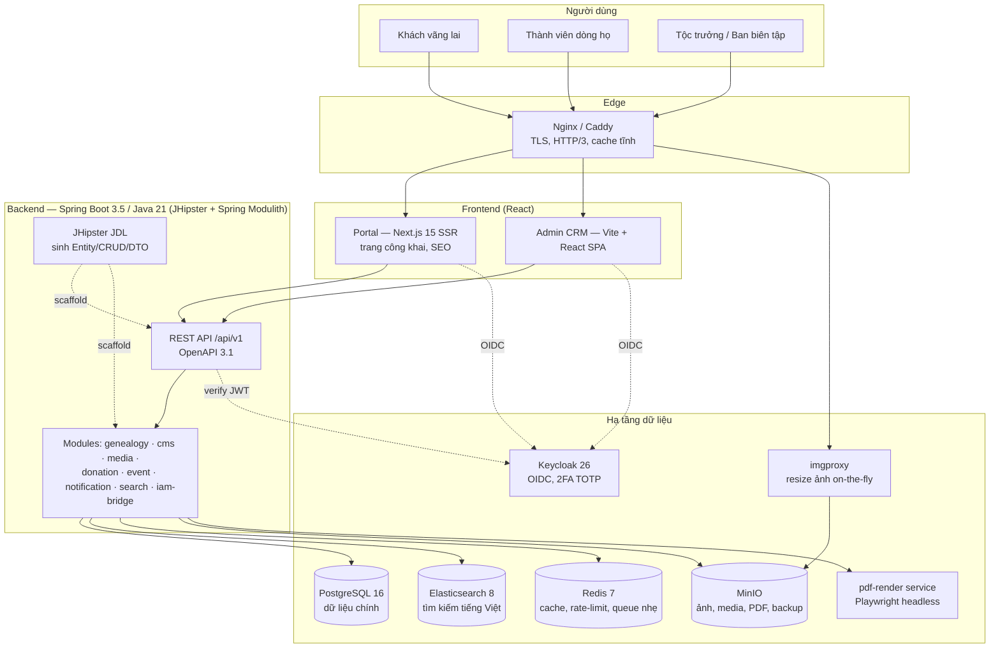
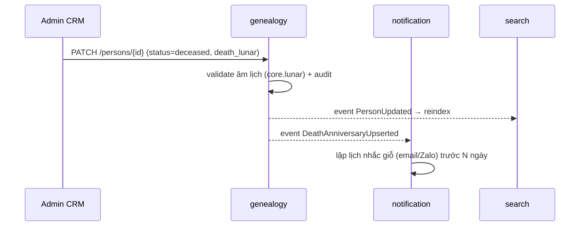
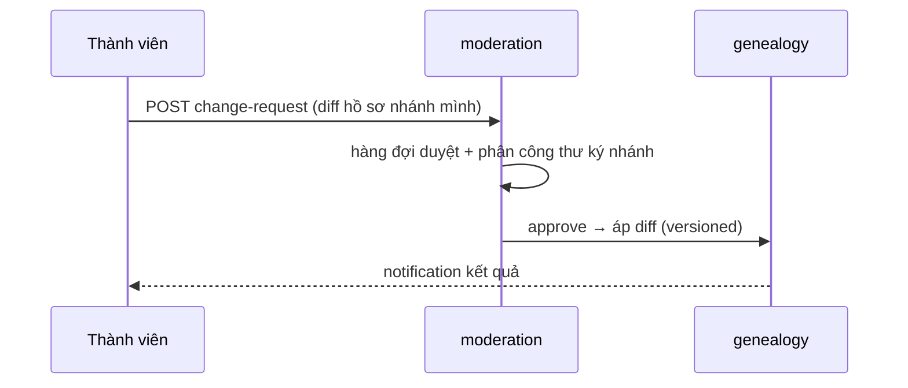

# TK-01 — Kiến trúc hệ thống

## 1. Kiến trúc tổng thể (C4 — mức Container)



**Quyết định then chốt**

| Quyết định | Lựa chọn | Lý do |
|-----------|----------|-------|
| Kiểu kiến trúc BE | **Modular monolith (Spring Modulith)** | 1 artifact dễ triển khai (yêu cầu 6); ranh giới module cưỡng chế bằng test (yêu cầu 8); tách microservice sau nếu cần |
| Sinh mã BE | **JHipster** (JDL, `--skip-client`) | Sinh Entity/Repository/Service/Resource/DTO/MapStruct/Liquibase/test CRUD chuẩn; tránh AI (và người) viết boilerplate lãng phí token/thời gian |
| FE tách 2 app | Portal (Next.js SSR) + Admin (SPA) | Portal cần SEO/OpenGraph như bản cũ; Admin cần tương tác dày, không cần SEO; **không** dùng client mặc định của JHipster |
| Giao tiếp module | Sự kiện nội bộ (Spring Modulith events + outbox) | Không gọi chéo trực tiếp giữa module → thay module không vỡ hệ |
| Multi-tenant | Cột `tree_id`/`org_id` + Postgres RLS (giai đoạn SaaS) | Một mã nguồn phục vụ nhiều dòng họ như bản cũ (multi gia phả theo tỉnh) |

## 2. Cấu trúc monorepo

```
family-tree/
├── backend/                     # Spring Boot (Gradle) — bootstrap & entity qua JHipster
│   ├── *.jdl                    # mô hình miền (JHipster Domain Language) — nguồn sinh CRUD
│   └── src/main/java/vn/giapha/
│       ├── core/                # shared kernel: tenant, lunar-calendar, security, audit
│       ├── genealogy/           # LÕI: person, union, chapter, anniversary, export
│       ├── cms/                 # post, category, comment, page
│       ├── media/               # album, photo, MinIO adapter
│       ├── donation/            # campaign, contribution, honor board
│       ├── event/               # sự kiện, RSVP, phân công
│       ├── notification/        # email, Zalo OA, web push (outbox)
│       ├── search/              # ES indexer + query API
│       ├── moderation/          # change-request, duyệt tự khai
│       └── iam/                 # bridge Keycloak, profile, RBAC
├── frontend/
│   ├── apps/portal/             # Next.js — trang công khai
│   ├── apps/admin/              # Vite React — CRM
│   └── packages/
│       ├── ui/                  # design system: shadcn components + Storybook
│       ├── tokens/              # build output từ design-tokens (CSS vars, TS)
│       ├── lunar/               # thư viện âm lịch TS (thuật toán amlich)
│       └── tree-viz/            # phả đồ: React Flow render + layout engine gia phả riêng
├── design-tokens/               # DTCG JSON — SOURCE OF TRUTH giao diện
├── deploy/                      # compose/, helm/, nginx/, env mẫu
├── instruction/                 # bộ thiết kế (TK-00…TK-11)
├── SRS/                         # đặc tả reverse-engineer bản cũ
└── CLAUDE.md                    # luật cho AI agent (TK-11)
```

## 3. Module hóa kiểu NukeViet — hiện đại hóa

Bản cũ: mỗi module NukeViet có route, block, quyền, bảng riêng, bật/tắt được. Bản mới ánh xạ:

| Khái niệm NukeViet | Thiết kế mới |
|--------------------|--------------|
| Module (news, photos, gia-pha…) | Spring Modulith module + FE feature folder tương ứng |
| Bật/tắt module | Feature flag trong bảng `module_registry`, API `/api/v1/system/modules`; FE ẩn route/menu theo flag |
| Block trang chủ | Widget registry: portal đọc cấu hình block (loại, thứ tự, tham số) từ API — soạn trang chủ không cần sửa code |
| Module ảo (chuyên mục news) | Category của module CMS, có route + layout riêng |
| Quyền theo module | RBAC: permission dạng `module:action:scope` (vd `genealogy:person:write`) |

**Quy tắc ranh giới** (cưỡng chế bằng `ModulithTest`):
1. Module chỉ public gói `api/` (DTO + service interface) và `events/`; mọi thứ khác `internal/`.
2. Không truy vấn bảng của module khác; cần dữ liệu thì gọi API nội bộ hoặc nghe sự kiện.
3. Sự kiện nghiệp vụ đặt tên quá khứ: `PersonDeceasedRecorded`, `PostPublished`, `ContributionReceived`.
4. Mỗi module tự có changelog Liquibase theo ngữ cảnh JHipster / package module (`config/liquibase/…` hoặc namespace tương đương); migration phải **backward-compatible 1 phiên bản** (expand → migrate → contract).

## 3.1 Sinh mã backend bằng JHipster (bắt buộc)

Mục tiêu: **AI không viết tay** lớp CRUD/boilerplate; chỉ viết JDL + logic nghiệp vụ sau khi generate.

| Bước | Ai làm | Việc |
|------|--------|------|
| 1. Bootstrap | Người / CI một lần | `jhipster` monolith, Java 21, Gradle, OAuth2/OIDC **Keycloak**, PostgreSQL, **`--skip-client`**, bật springdoc-openapi |
| 2. Mô hình | Người hoặc AI viết **JDL** (không viết Java entity tay) | Entity, quan hệ, DTO fields, pagination — file `backend/*.jdl` (vd `genealogy.jdl`) |
| 3. Generate | CLI | `jhipster jdl <file>.jdl` → Entity, Repository, Service, REST Resource, MapStruct, Liquibase, test scaffold |
| 4. Module hóa | Người / AI | Di chuyển/đặt package theo Spring Modulith (`genealogy/`, `cms/…`); chỉ public `api/` + `events/` |
| 5. Nghiệp vụ | Người / AI | Privacy filter, âm lịch, sự kiện Modulith, `@RequiresPermission`, quy tắc họ tộc — **không** regenerate đè tay nếu chưa diff JDL |

**Cấm khi có JHipster:** AI tự sinh hàng loạt `*Resource` / `*Repository` / `*Entity` / DTO mapper CRUD “từ đầu”. Được phép: sửa JDL → regenerate có kiểm soát, hoặc chỉnh tay **domain service** / adapter đã có.

**Ranh giới với FE:** Portal/Admin vẫn Next.js + Vite riêng; OpenAPI từ backend (springdoc) → `openapi-typescript` cho FE. Không dùng blueprint Angular/React của JHipster cho UI sản phẩm.

## 4. Luồng nghiệp vụ tiêu biểu

### 4.1 Cập nhật hồ sơ người mất → ngày giỗ + thông báo


### 4.2 Con cháu tự khai → duyệt (moderation)


## 5. Yêu cầu chất lượng kiến trúc

| Thuộc tính | Mục tiêu | Cơ chế |
|-----------|----------|--------|
| Hiệu năng | Phả đồ 2.000 node < 1,5s TTI; API p95 < 300ms | Cache Redis (cây con, thống kê), ES cho search, ISR/SSG cho trang tin |
| Sẵn sàng | 99,5% (1 VPS) → 99,9% (HA) | Compose single-node trước; Helm/K8s khi cần |
| Mở rộng | 100k person/tree, 50 tenant | Đánh index theo `tree_id`, RLS, phân trang keyset |
| Bảo trì | Module thay độc lập | Modulith test, OpenAPI contract, sự kiện versioned |
| Quan sát | Log-metric-trace tập trung | OpenTelemetry → Grafana LGTM stack (TK-09) |
