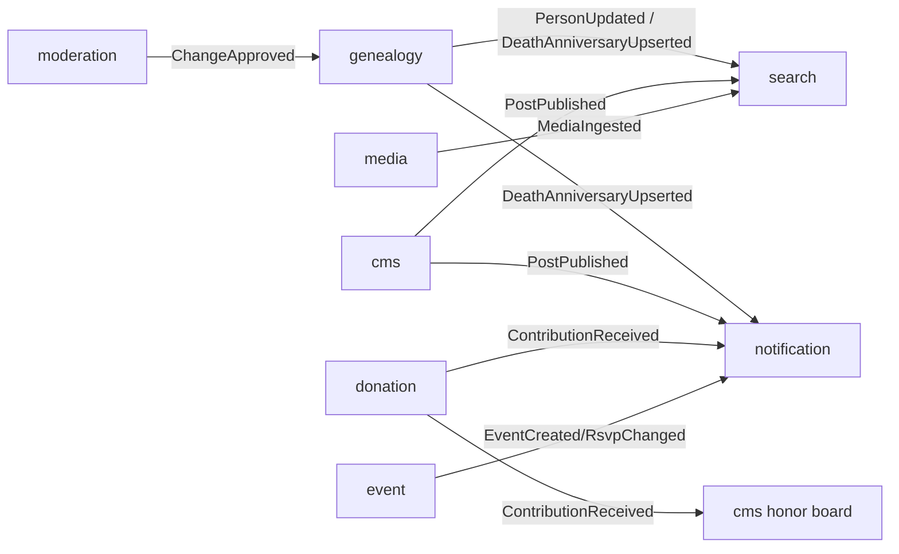

# TK-08 — Chuẩn API & Hợp đồng module hóa

## 1. Chuẩn REST API

- Base: `/api/v1` · JSON · OpenAPI 3.1 sinh từ code (springdoc) → CI publish `openapi.json` → FE typegen (`openapi-typescript`), **cấm gọi API ngoài types sinh ra**.
- Định danh: UUIDv7; slug cho public URL.
- Phân trang: keyset (`?after=` + `limit`), trả `meta.next_cursor`.
- Lỗi: RFC 9457 Problem Details (`type`, `title`, `detail`, `errors[]` theo field).
- Versioning: URI major (`/v1`); thay đổi phá vỡ → `/v2` chạy song song 1 release.
- Idempotency: header `Idempotency-Key` cho POST tài chính (donation).
- Rate limit: Redis bucket theo IP + user (viết ở gateway filter), trả `429 + Retry-After`.

### Nhóm endpoint tiêu biểu (rút gọn)

```
GET  /api/v1/trees/{slug}                        # thông tin chung + stats
GET  /api/v1/trees/{slug}/persons?query=&gen=    # tìm/lọc người (proxy ES)
GET  /api/v1/trees/{slug}/persons/{code}         # hồ sơ (ẩn trường theo privacy)
GET  /api/v1/trees/{slug}/chart?root=A7&depth=6  # JSON cây cho tree-viz (cache Redis)
GET  /api/v1/trees/{slug}/anniversaries?month=6&cal=lunar
POST /api/v1/trees/{slug}/change-requests        # tự khai (member)
POST /api/v1/exports/tree-book                   # job xuất sách → 202 + /jobs/{id}
GET  /api/v1/posts?category=&page...             # CMS public
POST /api/v1/admin/persons                       # CRM (role-guarded)
GET  /api/v1/system/modules                      # registry bật/tắt module
GET  /api/v1/widgets/home                        # cấu hình block trang chủ
```

## 2. Hợp đồng giữa các module (Spring Modulith)



**Quy tắc:**
1. Sự kiện là **bản ghi bất biến, versioned** (`PersonUpdated.v1`); consumer bỏ qua field lạ (tolerant reader).
2. Xuất bản qua **transactional outbox** của Modulith (`@ApplicationModuleListener`) — không mất event khi rollback.
3. Module chỉ expose `api/` (interface + DTO) và `events/`; vi phạm bị chặn bởi `ApplicationModules.verify()` chạy trong CI.
4. Cross-module query đọc: cho phép **view read-only riêng** (schema `read_`) do module chủ sở hữu định nghĩa — tránh join xuyên module tùy tiện.

## 3. Bật/tắt module & widget (parity NukeViet)

- `module_registry`: `{code, enabled, config jsonb, version}`; API system trả danh sách cho FE.
- BE: bean của module gắn `@ConditionalOnModuleEnabled("donation")` (annotation tự viết đọc registry) — module tắt là route 404 + listener ngừng.
- FE: route/menu render theo registry; block widget chỉ hiện khi module bật.
- Thêm module mới = 1 thư mục BE + 1 feature folder FE + migration + đăng ký registry: **không sửa lõi** (mở rộng kiểu NukeViet nhưng type-safe).

## 4. Chuẩn bảo vệ API (tóm tắt, chi tiết TK-10)

- AuthN: Bearer JWT (Keycloak); portal SSR dùng token exchange, admin SPA dùng PKCE.
- AuthZ: annotation `@RequiresPermission("genealogy:person:write")` + scope subtree kiểm tra bằng `lineage_path`.
- Privacy filter tầng serializer: người `alive` → ẩn ngày sinh đầy đủ, SĐT, địa chỉ với role < member (theo NĐ13 — TK-10 §3).
- Input: Bean Validation + Zod đối xứng; upload chỉ nhận mime whitelist, quét av (ClamAV sidecar tùy chọn).
