# TK-09 — Đóng gói & Triển khai

> Mục tiêu (yêu cầu 6): một dòng họ thuê 1 VPS 4GB là chạy được; nâng cấp không downtime dữ liệu.
> Cấu hình máy chủ chi tiết theo giai đoạn + workflow CI/CD đầy đủ: xem [12-cau-hinh-ha-tang-cicd.md](12-cau-hinh-ha-tang-cicd.md).

## 1. Đóng gói

| Artifact | Cách build |
|----------|-----------|
| `giapha-api` | Spring Boot → OCI image bằng **Buildpacks** (`bootBuildImage`), JRE 21 slim, non-root, ~250MB |
| `giapha-portal` | Next.js standalone output → node:22-alpine, non-root |
| `giapha-admin` | Vite build → static, serve bằng chính Nginx edge |
| `giapha-pdf` | Node + Playwright (image `mcr.microsoft.com/playwright`) |
| Hạ tầng | Image chính hãng: postgres:16, elasticsearch:8.16, redis:7, minio, keycloak:26, imgproxy, grafana LGTM |

- Tag ảnh theo SemVer + SHA; ký bằng cosign; SBOM (Syft) đính kèm release (TK-10).
- Tất cả cấu hình qua **biến môi trường** (12-factor), file `.env.example` đầy đủ chú thích tiếng Việt.

## 2. Tô-pô triển khai

### Profile A — "Một dòng họ, một VPS" (mặc định)
```
deploy/compose/
├── docker-compose.yml        # core: api, portal, admin, pg, redis, minio, keycloak, nginx
├── docker-compose.search.yml # + elasticsearch (bật khi >2GB RAM trống; tắt thì dùng PG FTS fallback)
├── docker-compose.obs.yml    # + grafana LGTM, umami
└── .env.example
```
- 1 lệnh: `./deploy.sh up` (script kiểm tra RAM, sinh secret, chạy migration, seed admin).
- Nginx: TLS tự động (certbot/Caddy option), HTTP/3, cache static + imgproxy.

### Profile B — SaaS nhiều dòng họ (R3)
- Helm chart `deploy/helm/giapha` (K8s): HPA cho api/portal, PG operator (CloudNativePG), MinIO distributed, ES 3 node.
- Multi-tenant: 1 cụm dùng chung, RLS theo `tree_id`; custom domain từng họ qua ingress.

## 3. CI/CD (GitHub Actions)

```mermaid
graph LR
    PR[Pull Request] --> G1[Gate A: build+unit+Modulith verify]
    G1 --> G2[Gate B: token lint / no-hardcode]
    G2 --> G3[Gate C: Playwright visual diff]
    G3 --> G4[Gate D: axe a11y]
    G4 --> G5[Gate S: Semgrep + Trivy + gitleaks + OWASP dep check]
    G5 --> RV[Human review + designer review trên preview]
    RV --> MAIN[merge main] --> STG[auto deploy staging]
    STG --> E2E[E2E smoke + ZAP baseline] --> REL[tag → deploy production có approve]
```



- Preview environment mỗi PR (compose ephemeral hoặc Vercel cho portal) — designer review trên bản chạy thật, không duyệt bằng Figma (PDF §6.6/4.4).
- Migration Liquibase (JHipster) chạy trước app (init container / compose depends healthcheck); mọi migration phải **backward-compatible 1 phiên bản** (expand → migrate → contract).

## 4. Sao lưu & khôi phục (dữ liệu tổ tiên là không thể mất)

| Đối tượng | Cơ chế | Tần suất | Lưu |
|-----------|--------|----------|-----|
| PostgreSQL | `pg_dump` custom + WAL (pgBackRest ở profile B) | ngày / liên tục | MinIO `backups` (object-lock 90 ngày) + rclone sang site 2/S3 ngoài |
| MinIO media | versioning + `mc mirror` sang site 2 | ngày | — |
| Keycloak realm | `kc export` | tuần | backups |
| ES | snapshot repo (MinIO) | ngày | rebuild được từ PG nếu mất |

- **Diễn tập khôi phục hằng quý** (restore vào staging, checksum số người/số bài) — đưa vào runbook.
- RPO ≤ 24h (profile A), RTO ≤ 4h theo runbook `deploy/runbooks/restore.md`.

## 5. Giám sát & vận hành

- OpenTelemetry SDK (BE+FE) → Grafana LGTM; dashboard sẵn: API latency, lỗi 5xx, queue outbox, job xuất PDF, dung lượng MinIO.
- Alert (email/Zalo webhook): disk >80%, backup fail, certificate sắp hết hạn, 5xx spike.
- Healthcheck chuẩn: `/actuator/health` (liveness/readiness), synthetic check trang chủ + login mỗi 5'.
- Umami analytics self-host thay thống kê truy cập (block public đọc qua API của Umami).
