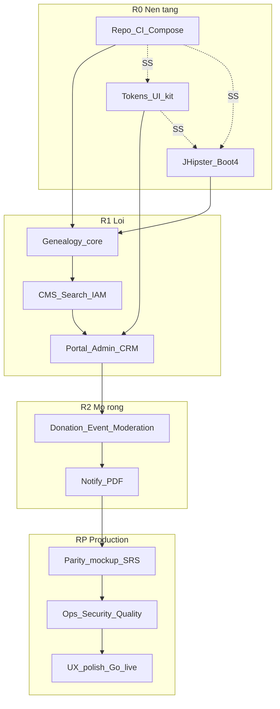

# TK-13 — Kế hoạch thực hiện GiaPhaHub (checklist + song song)

> Nguồn: [00-tong-quan.md](00-tong-quan.md), TK-01…TK-12, [SRS/00-tong-hop.md](../SRS/00-tong-hop.md), [CLAUDE.md](../CLAUDE.md).  
> Quy ước: mỗi mục `- [ ]` đánh dấu khi xong. **[SS]** = được phép làm song song với mục được nêu. Không ước lượng ngày.  
> **Giai đoạn hiện tại:** sau R0–R2 (khung MVP/mở rộng đã đánh dấu), trọng tâm chuyển sang **RP — Hoàn thiện sản phẩm production** (không còn tư duy “MVP chạy được là đủ”).

---

## Nguyên tắc chia việc

1. Một PR / một slice: chỉ 1 module hoặc 1 màn hình + test/gate liên quan.
2. BE CRUD mới: JDL → `jhipster jdl` trước; AI chỉ logic miền (TK-01 §3.1).
3. UI: token + `packages/ui` trước khi làm màn hình thật (TK-11).
4. Không claim xong khi thiếu bằng chứng gate A/B/D (và C/S khi đụng UI/auth).
5. **[SS]** chỉ mở khi không phụ thuộc artifact của nhánh kia (API contract / token / image compose).
6. **RP:** mỗi mục phải *hoạt động end-to-end trên staging* (DB thật, kênh thật khi có, không stub/demo giả làm chính).

---

## R0 — Nền tảng (làm trước mọi tính năng)

### R0.1 Repo & chuẩn làm việc
- [x] Cấu trúc monorepo theo TK-01 (`backend/`, `frontend/apps/*`, `frontend/packages/*`, `design-tokens/`, `deploy/`)
- [x] README gốc: cách chạy local, link TK/SRS
- [x] Branch protection `main` + Environments staging/production (TK-12 §5) — checks `backend`/`frontend`/`security`, 1 approval, cấm force-push; prod reviewer `@caprocute`
- [x] Glossary thuật ngữ VN — [14-glossary.md](14-glossary.md)

### R0.2 Hạ tầng DEV  **[SS với R0.3, R0.4]**
- [x] Compose mẫu `deploy/compose/` + infra remote `deploy/remote/` (port tách khỏi `st-*`)
- [x] Services DEV: Postgres/Redis/MinIO/ES/Keycloak trên server + skill `/infra-tunnel`
- [x] `.env.example` / `.env.tunnel.local.example` / `.env.local.example` (secret không commit)
- [x] Script `seed-dev.sh` khung + `tunnel-infra.sh`

### R0.3 Design tokens  **[SS với R0.2, R0.4]**
- [x] `design-tokens/` DTCG JSON (heritage; light/dark + palette bang-vang/co; tet phase sau)
- [x] Style Dictionary → `frontend/packages/tokens`
- [x] CI/local: `pnpm lint:tokens` / `npm run lint:tokens` (Gate B) xanh

### R0.4 Bootstrap backend JHipster 9  **[SS với R0.2, R0.3]**
- [x] `npx generator-jhipster@9.2.0 jdl app.jdl` — Boot 4.0.7, OAuth2, `--skip-client` (bằng chứng `backend/JHIPSTER_GENERATE.md`)
- [x] `./gradlew compileJava` xanh (full Testcontainers check — bổ sung sau)
- [x] Keycloak realm JHipster trong `backend/src/main/docker/realm-config/`
- [x] springdoc-openapi (JHipster)
- [x] Spring Modulith 2.0.7 + `ApplicationModules.verify()` — `core`/`genealogy` + package JHipster `OPEN` (R0)
- [x] Entity genealogy + CMS/media đã `jhipster jdl` (không scaffold tay)

### R0.5 Frontend workspace  **[SS với R0.4 sau khi có OpenAPI; tokens cần R0.3]**
- [x] pnpm workspace: portal, admin, ui, tokens, lunar, tree-viz, api-types
- [x] Portal Next.js 15 + Admin Vite nối design tokens (CSS vars)
- [x] Storybook config `packages/ui` (+ addon-a11y)
- [x] Script `pnpm openapi` (chạy khi API local/tunnel lên)

### R0.6 CI tối thiểu  **[sau R0.3 + R0.4 + R0.5 stub]**
- [x] `.github/workflows/ci.yml`: backend compile + tokens Gate B + FE build/test + gitleaks
- [x] Gate B token-lint trong job frontend
- [x] visual.yml Gate C (cuối R1) + deploy workflows R1.10

**Cổng R0 (đạt tối thiểu):** tunnel infra OK; JHipster BE compile; FE portal/admin/ui build; lunar golden xanh; Gate B xanh; Modulith verify; branch protection + Environments.

---

## R0b — Design system lõi (20 component — chia nhỏ)

> **[SS một phần với R0.4/R1 BE]** miễn là không block chờ màn hình. Làm theo từng component (spec → code → story → doc).

Mỗi component: đủ 4 mảnh (TK-04) — code + story + `USAGE.md` (spec/mapping). Figma Code Connect gắn sau khi có component chuẩn trên file «Gia phả họ Hoàng».

### R0b.1 Form & input
- [x] Button, Input, Textarea, Select, Checkbox, Switch (+ stories + USAGE.md)
- [x] FormField (+ stories + USAGE.md; Zod helper — bổ sung khi form thật)
- [x] DualDatePicker (dương/âm) + lunar golden xanh (+ USAGE.md)

### R0b.2 Data & feedback  **[SS với R0b.1]**
- [x] DataTable, Pagination, Badge, Alert, Toast, Skeleton, EmptyState, Dialog (+ stories + USAGE.md)

### R0b.3 Navigation & layout  **[SS với R0b.1]**
- [x] AppShell (admin), PublicHeader/Footer (portal), Breadcrumb, Tabs (+ stories + USAGE.md)

### R0b.4 Domain UI sớm
- [x] LunarDateBadge, PersonNameDisplay (privacy stub), MediaLightbox (stub) (+ stories + USAGE.md)

### R0b.5 Âm lịch TS/Java  **[SS sớm, trước DualDatePicker hoàn chỉnh]**
- [x] Port amlich TS + golden vectors `frontend/shared/lunar-vectors/golden.json`
- [x] `core.lunar` Java đồng bộ cùng vectors (`LunarCalendarUnitTest` + golden.json)

**Cổng R0b (đạt):** ≥12/20 component có story + `USAGE.md` 4 mảnh (catalog `frontend/packages/ui/README.md`); DualDatePicker + lunar TS/Java xanh.

---

## R1 — Lõi nghiệp vụ (parity nền — trước đây gọi MVP)

### R1.1 Genealogy schema & JDL (BE)
- [x] JDL: Tree, Person, Union, Chapter (phả ký/tộc ước/hương hỏa), DeathAnniversary
- [x] `jhipster jdl` → Liquibase + entity
- [x] Xếp package Modulith `genealogy/` (`api/` + `events/` + privacy); entity JHipster vẫn `domain/` OPEN tạm
- [x] Privacy filter serializer (người sống) — TK-10 / NĐ13 (wire `PersonResource` GET)
- [x] API: CRUD person/union theo cây (`/api/v1/trees/{slug}/persons|unions`), sinh mã hiệu A7/A7-sp1 + lineage_path
- [x] Test authz `@RequiresPermission` + Modulith verify; ma trận role→permission (R1.5 `iam`)

### R1.2 Search index person  **[SS với R1.3 sau khi có Person API]**
- [x] Module `search`: index Person (ES `person_v1` hoặc PG `unaccent` khi `ES_URL` rỗng/down)
- [x] API suggest `GET /api/v1/search/persons/suggest?tree=&q=` (không dấu) + portal `/search`
- [x] Listener `PersonUpdated` → reindex ES

### R1.3 CMS tối thiểu  **[SS với R1.1 sau R0.4]**
- [x] JDL: Category, Post, Comment (duyệt cơ bản)
- [x] API public list/detail + admin CRUD (`GET /api/v1/posts|categories`; JHipster `/api/cms-posts` + `@RequiresPermission`; sự kiện `PostPublished`)
- [x] TipTap trong admin (`RichTextEditor`) + CRUD bài viết qua `/api/cms-posts` (portal `/news`)
- [x] SRS-12f: chuyên mục ↔ `/tin/{slug}`, seed VI, CRUD chuyên mục, TipTap + media/preview ([SRS/12f-admin-cms-bai-viet.md](../SRS/12f-admin-cms-bai-viet.md))

### R1.4 Media tối thiểu  **[SS với R1.3]**
- [x] Upload MinIO + metadata album/photo — `media/` Modulith: `MinioStorageService`, `MediaUploadController` (`POST /api/v1/media/upload`)
- [x] Presigned URL; imgproxy URL ký — `ImgproxyUrlBuilder` HMAC-SHA256; `signing-enabled: false` trên dev
- [x] Quyền upload chỉ admin/editor — `@PreAuthorize("hasAnyRole('ADMIN','EDITOR')")` + `@RequiresPermission("media:photo:upload")`; authz test `MediaUploadControllerIT` (cần Docker)

### R1.5 IAM & portal auth
- [x] Keycloak realm: roles `ROLE_EDITOR` / `ROLE_GENEALOGY_ADMIN` / `ROLE_MEMBER` (+ clients `giapha_admin` / `giapha_portal`) — `realm-config/README-IAM.md`
- [x] Bridge `iam`: `GET /api/v1/me`, ma trận role→permission, `@RequiresPermission` enforce thật
- [x] Portal/Admin login OIDC PKCE + silent renew (`packages/auth` + oidc-client-ts)
- [x] Admin `/login` form riêng (ROPC `giapha_admin`, UI CRM khác portal) — FR-12.1
- [x] 2FA qua Keycloak: `CONFIGURE_TOTP` bắt buộc admin/genealogy; recovery codes qua Account Console (SRS-10)

### R1.6 packages/tree-viz (phả đồ)
- [x] Layout engine: đời ngang, union node, thứ tự con (`layoutFamily` + vitest)
- [x] React Flow render + token style (`FamilyTreeCanvas`, Person/Union node)
- [x] Pan/zoom/minimap/fitView; export SVG/PNG (client, `html-to-image`)
- [x] Giới hạn depth/root (parity FR-04) — demo Portal `/tree`

### R1.7 Portal công khai  **[sau R0b đủ dùng + R1.1–1.4 API]**
Chia từng route (1 PR / route nếu lớn):
- [x] Trang chủ (hero full-bleed + block giỗ/tin cứng/API)
- [x] Tra cứu / hồ sơ người (`/persons`, `/persons/[code]` — privacy qua trees API)
- [x] Phả đồ (API persons → FamilyGraph; fallback demo)
- [x] Ngày giỗ (lọc tháng âm — `GET …/anniversaries?lunarMonth=` + demo)
- [x] Tin tức list/detail (API + demo fallback)
- [x] Album (MediaLightbox demo — chờ public album API)
- [x] Tìm kiếm (suggest + deep-link `?q=` → hồ sơ)

### R1.8 Admin CRM lõi  **[SS với R1.7 — cùng API]**
- [x] AppShell + menu CRM + OIDC login (RBAC BE R1.5; menu theo role tinh chỉnh sau)
- [x] Danh sách / form hồ sơ người + DualDatePicker + Zod → API `/api/v1/trees/{slug}/persons` (+ ngày mất → giỗ)
- [x] Tree editor tối thiểu (CRUD union + member/child — `/tree`)
- [x] Soạn phả đồ fullscreen SRS-12a — layout 3 cột + canvas SVG + Person/Union panel + `?root=` (`/tree`); v1.1: DualDate, mã hiệu BE, sửa hôn nhân, xóa khỏi cây, cha-con đơn thân (FR-12a.26–38)
- [x] Quản lý bài viết + duyệt comment (`/posts`, `/comments` → `/api/cms-posts` / `/api/cms-comments`)
- [x] Media library (album CRUD + upload `/api/v1/media/upload` + list/xóa photos)
- [x] Cài đặt site động — `GET/PUT /api/v1/trees/{slug}/settings` (metaJson) + admin `/settings` + portal header/footer/meta/tree/tự khai/nhắc giỗ (FR-12.18) — *chưa đủ 13 mục nav mockup → RP.1*

### R1.9 Ngày giỗ & sự kiện domain
- [x] Tự động upsert anniversary khi ghi người mất (`DeathAnniversarySync` + `DeathAnniversaryUpserted`; hook `TreeGenealogyService` / `PersonService`; unique `person_id`)
- [x] Widget “giỗ tháng này/sau” API + block portal — `GET /api/v1/trees/{slug}/anniversaries` (R1.7); upsert auto → còn lại
- [x] Golden tests can chi / nhuận (`golden.json` + vector tháng 2 nhuận 2023; FE/BE chung)

### R1.10 Đóng gói & staging R1  **[SS cuối với polish UI]**
- [x] Dockerfiles api + portal + admin (+ `docker-compose.apps.yml`); CI `build-publish.yml` → GHCR
- [x] `deploy-staging.yml` SSH + smoke HTTP (cần secrets/vars staging)
- [x] Backup script Postgres + MinIO — `deploy/scripts/backup-pg-minio.sh` (TK-09)
- [x] Gate C visual pilot (Button/Alert/Header/DataTable/GioCard) — `pnpm test:visual` + `visual.yml`
- [x] Gate S: semgrep/trivy trên CI (`ci.yml` security; continue-on-error lần đầu)

**Cổng R1:** 1 cây mẫu seed; khách xem phả đồ/giỗ/tin; admin CRUD người + bài; login 2FA; compose/staging chạy được. *(Đây là nền — chưa đủ tiêu chuẩn production.)*

---

## R2 — Mở rộng văn hóa & vận hành

> Các nhóm R2.x đã có khung UI/API (checklist [x]). **RP** sẽ nâng từ “có màn hình” → “đủ dùng thật cho tộc trưởng”.

### R2.1 Moderation — cổng tự khai (F3)
- [x] JDL/change_request + diff + hàng đợi duyệt
- [x] API member submit / admin approve-reject
- [x] UI portal “tự khai” + UI admin inbox

### R2.2 Donation — quỹ / VietQR (F4)  **[SS với R2.1]**
- [x] Campaign, contribution, honor board
- [x] VietQR động + sao kê công khai
- [x] Admin đối soát; biên nhận PDF đơn giản

### R2.3 Event — họp họ / điểm danh (F6)  **[SS với R2.1]**
- [x] Sự kiện âm/dương, RSVP theo hộ, phân công
- [x] Gallery đổ album (reuse media)

### R2.4 Notification (F1)  **[sau có anniversary + user link]**
- [x] Outbox email + Web Push
- [x] Zalo OA adapter
- [x] Đăng ký nhắc giỗ + iCal

### R2.5 Xưng hô (F2)  **[SS với R2.4 — pure genealogy graph]**
- [x] LCA + bảng luật xưng hô
- [x] API + UI “quan hệ với tôi” trên phả đồ

### R2.6 Khuyến học (F8)  **[SS — chủ yếu CMS]**
- [x] Category/workflow đề cử → duyệt → bảng vàng
- [x] SRS chặt: [SRS/12c-admin-khuyen-hoc.md](../SRS/12c-admin-khuyen-hoc.md) (nguồn→đích, đợt CRUD, quỹ `purpose`)
- [x] Entity `ScholarshipAwardRound` + `ScholarshipAward` + UI Quản lý đợt (đóng debt §6 SRS-12c)
- [x] Bỏ nhãn đợt ghép từ tháng/năm máy; banner theo đợt `open`

### R2.7 PDF sách gia phả (F10)  **[sau tree-viz ổn]**
- [x] Service `pdf-render` Playwright
- [x] Template bìa / chương / chia trang phả đồ
- [x] Job xuất + lưu MinIO

### R2.8 CRM nâng cao
- [x] Dashboard thống kê (Recharts token)
- [x] Audit log UI
- [x] Module on/off (`module_registry`)

**Cổng R2 (khung):** tự khai có duyệt; chiến dịch công đức; nhắc giỗ; PDF mẫu. *(Độ sâu production → RP.)*

---

## RP — Hoàn thiện sản phẩm (Production)

> **Mục tiêu:** một bản phát hành cho dòng họ dùng thật — ổn định, an toàn, đủ nghiệp vụ SRS/mockup, vận hành được, không còn “demo/fallback/stub” làm luồng chính.  
> **Không thuộc RP:** F5 bản đồ mộ, F7 Hán-Nôm, F9 trợ lý AI, multi-tenant SaaS — giữ ở [Hàng đợi mở rộng](#hàng-đợi-mở-rộng-sau-go-live) sau go-live.

### Phân tích khoảng trống (hiện trạng → production)

| Trục | Hiện trạng (sau R1/R2) | Tiêu chí production |
|------|------------------------|---------------------|
| **Cấu hình hệ thống** | Nav 13 mục; SMTP gửi thật từ settings; secret metaJson qua Jasypt khi có master password | Audit list API; VAPID; rate-limit; backup job (RP.5) |
| **Soạn phả đồ** | SRS-12a v1.1 cơ bản | Parity mockup còn lại (skeleton, nhãn đời, panel quan hệ đầy đủ, audit, role FE) |
| **Portal** | Nhiều route còn demo/fallback khi API trống | Luồng chính 100% API; empty/error state nghiệp vụ; SEO/meta động |
| **CMS / Media** | CRUD có; album public/lightbox chưa hoàn | Gallery công khai, hẹn giờ đăng, trang tĩnh, trình quản lý file |
| **Công đức / Sự kiện / Tự khai / Nhắc giỗ** | Khung UI + API | Đối soát thật, SMTP/Zalo thật (hoặc tắt rõ), mockup admin parity, không lộ jargon UI |
| **IAM / RBAC** | Role Keycloak + permission catalog; **màn Tài khoản** FR-12.16 (duyệt/khóa/gán quyền/reset MK) | Thư ký nhánh (FR-12.10); đăng ký portal nối auth settings (FR-12.17) |
| **Riêng tư NĐ13** | Filter người sống cơ bản | Ma trận viewer đầy đủ; cấu hình PII trong settings; test + security-review |
| **Chất lượng** | Gate A/B pilot; Gate S continue-on-error | Gate A/B/C/D/S bắt buộc; E2E smoke staging; perf phả đồ ≥200 node |
| **Vận hành** | Script backup; deploy staging | Backup/restore có UI+cron; giám sát; runbook; prod env + HTTPS |
| **Dữ liệu** | Seed mỏng | Seed họ mẫu đầy đủ; import Excel/GEDCOM tối thiểu (nếu SRS yêu cầu); migration an toàn |

### Nguyên tắc RP

1. **Một usecase = một chuỗi liên kết:** admin đổi cấu hình → portal/CRM phản ánh trong ≤1 TTL (không hardcode).
2. **Không stub trên đường chính:** adapter chưa sẵn → tắt feature + thông báo nghiệp vụ, không giả “đã gửi Zalo”.
3. **Mockup là chuẩn bố cục; DS là chuẩn hoàn thiện UI** (`packages/ui` + tokens).
4. **Go-live checklist** phải xanh trước khi tuyên bố “sản phẩm”.

---

### RP.1 — Cấu hình hệ thống đầy đủ (FR-12.17–12.23, mockup settings)

> Mockup: `instruction/mockups/admin-settings.html` — 13 mục / 5 nhóm.

- [x] **Nav đầy đủ** khớp mockup; scroll/hash từng section; trạng thái “Sắp có” chỉ khi thật sự chưa làm (không để mục chết)
- [x] **Nhận diện:** logo/favicon upload MinIO + URL trong settings; ngân hàng/footer/social đầy đủ → portal footer
- [x] **Phả hệ:** tách section Âm–dương lịch (múi giờ, quy ước nhuận hiển thị) + Mã hiệu (prefix, mẫu preview) khỏi “cây”
- [x] **Đăng ký & xác thực:** bật/tắt tự kích hoạt, captcha, quy định thành viên — preference trong settings (nối IdP/portal ở RP.4)
- [x] **Quyền riêng tư & PII:** toggle mask ngày sinh, mức mặc định `privacy` người sống — ăn `PersonPrivacyFilter` + createPerson (FR-12a.25 / NĐ13)
- [x] **Phân quyền vai trò:** UI xem ma trận role→permission (read-only); không lộ tên kỹ thuật trên UI
- [x] **Email (SMTP):** host/port/from + mật khẩu không trả GET; gửi thử thật; Jasypt khi có `JASYPT_ENCRYPTOR_PASSWORD` (FR-12.22 / RP.4)
- [x] **Zalo OA:** app id / OA id / token không trả GET; dry-run vs gửi thật; tắt kênh nếu mode=off
- [x] **Nhắc nhở & giỗ:** đồng bộ với subscription mặc định (ngày trước, kênh) — portal lọc Zalo theo mode
- [x] **Sao lưu & khôi phục:** lịch + giờ trong settings (job/restore runbook — RP.5)
- [x] **Tích hợp & webhook:** URL + secret (không echo GET) trong settings
- [~] **Nhật ký audit:** section + deep-link hệ thống; lọc nâng cao / list API — RP.4–RP.5 (FR-12.2)
- [x] SRS chi tiết: [12b-admin-cau-hinh.md](../SRS/12b-admin-cau-hinh.md) (13 mục) + [15-production-go-live.md](../SRS/15-production-go-live.md) (RP.2–6)

**Cổng RP.1:** lưu settings trên staging; đổi tên/logo/SMTP(test)/privacy → portal & mail phản ánh; secret không plaintext trong git.

---

### RP.2 — CRM & phả hệ “dùng hàng ngày”

- [ ] Soạn phả đồ: còn lại SRS-12a (skeleton, nhãn đời FR-12a.10, badge sidebar, pan animated, FE role TREE_EDITOR)
- [ ] Hồ sơ người: đủ field SRS-12.5 (ảnh chân dung, mộ, danh xưng); không hardcode lifeStatus lệch `alive`/`deceased`
- [ ] Chương Phả ký / Tộc ước / Hương hỏa rich-text (FR-12.7) + portal đọc
- [ ] Xuất PDF/Excel phả đồ theo cấu hình chương (FR-12.9 / F10 nâng độ tin cậy)
- [ ] Import hàng loạt Excel tối thiểu (FR-12.9) hoặc GEDCOM subset — 1 trong 2 trước go-live
- [x] Admin donation / events / media / scholarship / moderation: **parity mockup** tương ứng (`admin-*.html`) + bỏ empty demo — *donation + events + notifications + dashboard + persons + posts + comments + system + scholarship xong; media/moderation còn*
- [x] Dashboard: số liệu thật (thành viên, **giỗ tháng âm hiện tại**, CR pending, quỹ) + greeting/⌘K/quick actions/audit — không số giả
- [ ] Menu CRM theo permission thực; ẩn mục không được phép
- [x] **Tài khoản đăng nhập (FR-12.16):** admin `/users` — duyệt/khóa/kích hoạt, gán nhóm quyền, mật khẩu tạm, lịch sử đăng nhập (facade Admin API)

**Cổng RP.2:** tộc trưởng thêm người–hôn phối–duyệt tự khai–đăng tin–upload album trên staging không cần “biết API”.

---

### RP.3 — Portal công khai chuyên nghiệp

- [ ] Loại bỏ fallback demo trên đường chính (phả đồ / tin / giỗ / album) khi API có dữ liệu; empty state rõ khi chưa có
- [ ] Gallery album public API + lightbox thật
- [ ] Trang tĩnh (Giới thiệu, Điều khoản) từ CMS (FR-12.12)
- [ ] Block trang chủ cấu hình được (bật/tắt/thứ tự) — FR-02 / FR-12.19 tối thiểu
- [ ] Hồ sơ + tìm kiếm + xưng hô + công đức + sự kiện: copy nghiệp vụ, a11y, mobile
- [ ] PWA nhẹ (install + offline đọc hồ sơ/giỗ đã cache) — *không* multi-tenant
- [ ] Performance: LCP trang chủ; phả đồ 200+ node mượt (SRS-12a §9)

**Cổng RP.3:** khách vãng lai dùng portal staging như site họ thật; Lighthouse/a11y đạt ngưỡng nội bộ.

---

### RP.4 — Thông báo, bảo mật, tuân thủ

- [x] Reminder planner chạy cron staging; **SMTP từ TreeSettings** gửi thật qua `TreeMailSender` + `POST …/settings/smtp/test` (E2E khi có host)
- [x] Zalo: mode=off / chưa webhook → dry-run; UI settings «chưa kết nối» khi tắt
- [ ] Web Push: VAPID thật hoặc ẩn khỏi UI
- [ ] Rate limit đăng nhập; HTTPS bắt buộc prod; không jargon trên UI (rule `no-tech-jargon-on-ui`)
- [x] Privacy regression tests (+ public/private matrix) — vẫn cần `/security-review` người duyệt 2 cho secret
- [x] Gate S: Semgrep **fail CI**; Trivy CRITICAL **fail**; HIGH vẫn report
- [ ] Audit mọi thao tác sửa cây / duyệt CR / đổi settings

**Cổng RP.4:** checklist ATTT TK-10 go-live; không secret plaintext; PII người sống được chứng minh bằng test.

---

### RP.5 — Chất lượng kỹ thuật & vận hành

- [ ] E2E smoke (Playwright): login admin, CRUD 1 người, xem portal hồ sơ, gửi tự khai
- [ ] IT Testcontainers ổn định trên CI (Postgres) — giảm phụ thuộc “cần Docker tay”
- [ ] OpenAPI → `api-types` sync trong CI; FE không gọi path lệch
- [ ] Observability: health/metrics; log correlation; alert cơ bản (TK-09/12)
- [ ] Backup tự động + thử restore 1 lần trên staging
- [ ] Runbook vận hành (tunnel, seed, deploy, rollback) trong `deploy/` hoặc `instruction/`
- [ ] Seed dữ liệu họ mẫu đủ demo go-live (không dữ liệu PII thật nếu chưa có thỏa thuận)
- [ ] Môi trường **production** GitHub Environment + secrets; pipeline deploy prod có approval

**Cổng RP.5:** staging = bản gold; một lần restore backup thành công; CI đỏ = không merge.

---

### RP.6 — Go-live & bàn giao

- [ ] UAT với tộc trưởng / thư ký trên checklist nghiệp vụ (1–2 buổi)
- [ ] Tài liệu người dùng ngắn (PDF/Markdown): đăng nhập, soạn phả, duyệt tự khai, cấu hình site
- [ ] Soft-launch 1 dòng họ; theo dõi lỗi 2 tuần
- [ ] Định nghĩa SLO nội bộ (uptime staging/prod, RPO/RTO backup)
- [ ] Đóng cổng RP → chỉ nhận bugfix + hạng mục hàng đợi mở rộng

**Cổng RP (sản phẩm):** UAT đạt; prod chạy HTTPS; backup/restore đã thử; không còn stub trên đường chính; cấu hình & CRM đủ dùng hàng ngày.

---

## Hàng đợi mở rộng (sau go-live)

> Trước đây thuộc R3 — **không chặn** phát hành production. Làm sau khi cổng RP đạt.

| Mã | Hạng mục | Ghi chú |
|----|----------|---------|
| F5 | Bản đồ mộ + QR bia | Geo + map UI + deep-link hồ sơ |
| F7 | Di sản Hán-Nôm | Viewer độ phân giải cao + phiên âm/dịch có duyệt |
| F9 | Trợ lý AI gia phả | RAG theo tree + guardrail PII + citation |
| SaaS | Multi-tenant / custom domain | RLS `tree_id`, Helm Profile B (TK-09) |
| DX | Collaborative edit / Undo phả đồ | Out of scope SRS-12a v1 |

---

## Luồng song song gợi ý (tóm tắt)

| Cùng lúc | Điều kiện |
|----------|-----------|
| R0.2 Compose ∥ R0.3 Tokens ∥ R0.4 JHipster | Không chờ nhau *(đã xong)* |
| R1.7 Portal ∥ R1.8 Admin | Cùng contract OpenAPI *(đã xong khung)* |
| **RP.1 Settings ∥ RP.2 CRM polish** | Không đụng cùng schema migration |
| **RP.3 Portal ∥ RP.4 Notify/SMTP** | Settings SMTP xong trước khi E2E mail |
| **RP.5 CI/E2E ∥ RP.2 mockup parity** | Sau khi API ổn định |

**Không song song:** RP.6 go-live trước khi RP.1–RP.5 cổng đạt; bật Zalo/SMTP prod trước khi secret Jasypt + security-review.

---

## Việc cắt ngang (mọi giai đoạn)

- [ ] Mỗi PR: link TK/FR; CI xanh
- [ ] Diff auth/donation/privacy/upload → `/security-review` + người duyệt 2
- [ ] Learn loop: sửa tay AI → cập nhật rule/token/story trong tuần
- [ ] Dependency mới → ghi [02-lua-chon-cong-nghe.md](02-lua-chon-cong-nghe.md) + license
- [ ] Drift audit tokens định kỳ (TK-11)
- [ ] **RP:** mọi PR chạm UI phải `lint:tokens` + không jargon trên giao diện

---

## Thứ tự ưu tiên (giai đoạn RP)

1. **RP.1** Cấu hình đầy đủ (SMTP + privacy + settings mockup) — nền cho mọi usecase  
2. **RP.4** Kênh thông báo thật + Gate S bắt buộc + PII  
3. **RP.2** CRM/phả đồ/mockup admin parity — công cụ hàng ngày của thư ký  
4. **RP.3** Portal bỏ demo, gallery, SEO, perf  
5. **RP.5** E2E, backup/restore, prod pipeline  
6. **RP.6** UAT → soft-launch → đóng cổng RP  
7. Chỉ sau đó: hàng đợi F5 / F7 / F9 / SaaS
