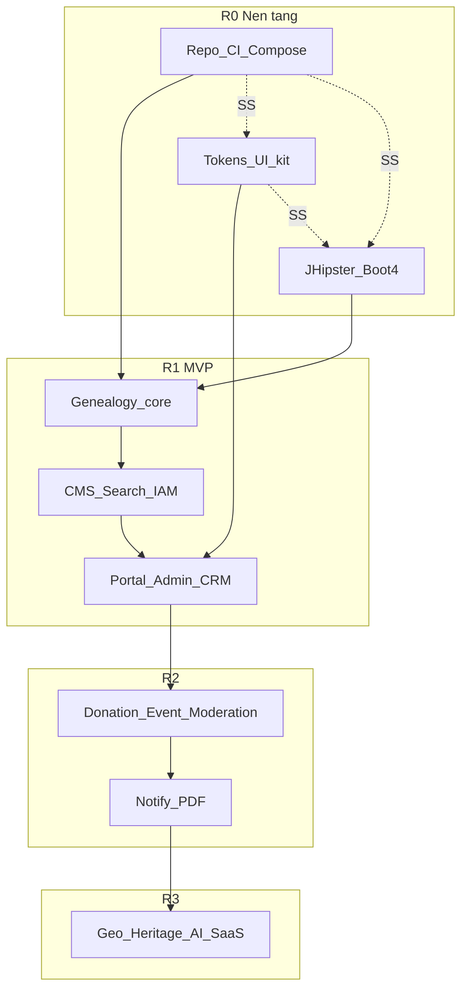

# TK-13 — Kế hoạch thực hiện GiaPhaHub (checklist + song song)

> Nguồn: [00-tong-quan.md](00-tong-quan.md), TK-01…TK-12, [SRS/00-tong-hop.md](../SRS/00-tong-hop.md), [CLAUDE.md](../CLAUDE.md).  
> Quy ước: mỗi mục `- [ ]` đánh dấu khi xong. **[SS]** = được phép làm song song với mục được nêu. Không ước lượng ngày.

---

## Nguyên tắc chia việc

1. Một PR / một slice: chỉ 1 module hoặc 1 màn hình + test/gate liên quan.
2. BE CRUD mới: JDL → `jhipster jdl` trước; AI chỉ logic miền (TK-01 §3.1).
3. UI: token + `packages/ui` trước khi làm màn hình thật (TK-11).
4. Không claim xong khi thiếu bằng chứng gate A/B/D (và C/S khi đụng UI/auth).
5. **[SS]** chỉ mở khi không phụ thuộc artifact của nhánh kia (API contract / token / image compose).

---

## R0 — Nền tảng (làm trước mọi tính năng)

### R0.1 Repo & chuẩn làm việc
- [x] Cấu trúc monorepo theo TK-01 (`backend/`, `frontend/apps/*`, `frontend/packages/*`, `design-tokens/`, `deploy/`)
- [x] README gốc: cách chạy local, link TK/SRS
- [ ] Branch protection `main` + Environments staging/production (TK-12 §5) — làm khi có remote GitHub
- [x] Glossary thuật ngữ VN — [14-glossary.md](14-glossary.md)

### R0.2 Hạ tầng DEV  **[SS với R0.3, R0.4]**
- [x] Compose mẫu `deploy/compose/` + infra remote `deploy/remote/` (port tách khỏi `st-*`)
- [x] Services DEV: Postgres/Redis/MinIO/ES/Keycloak trên server + skill `/infra-tunnel`
- [x] `.env.example` / `.env.tunnel.local.example` / `.env.local.example` (secret không commit)
- [x] Script `seed-dev.sh` khung + `tunnel-infra.sh`

### R0.3 Design tokens  **[SS với R0.2, R0.4]**
- [x] `design-tokens/` DTCG JSON (heritage / light; dark/tet phase sau)
- [x] Style Dictionary → `frontend/packages/tokens`
- [x] CI/local: `pnpm lint:tokens` / `npm run lint:tokens` (Gate B) xanh

### R0.4 Bootstrap backend JHipster 9  **[SS với R0.2, R0.3]**
- [x] `npx generator-jhipster@9.2.0 jdl app.jdl` — Boot 4.0.7, OAuth2, `--skip-client` (bằng chứng `backend/JHIPSTER_GENERATE.md`)
- [x] `./gradlew compileJava` xanh (full Testcontainers check — bổ sung sau)
- [x] Keycloak realm JHipster trong `backend/src/main/docker/realm-config/`
- [x] springdoc-openapi (JHipster)
- [ ] Spring Modulith 2.x + `ApplicationModules.verify()` — xếp package sau generate
- [x] Entity genealogy + CMS/media đã `jhipster jdl` (không scaffold tay)

### R0.5 Frontend workspace  **[SS với R0.4 sau khi có OpenAPI; tokens cần R0.3]**
- [x] pnpm workspace: portal, admin, ui, tokens, lunar, tree-viz, api-types
- [x] Portal Next.js 15 + Admin Vite nối design tokens (CSS vars)
- [x] Storybook config `packages/ui` (+ addon-a11y)
- [x] Script `pnpm openapi` (chạy khi API local/tunnel lên)

### R0.6 CI tối thiểu  **[sau R0.3 + R0.4 + R0.5 stub]**
- [x] `.github/workflows/ci.yml`: backend compile + tokens Gate B + FE build/test + gitleaks
- [x] Gate B token-lint trong job frontend
- [ ] (Chưa bắt buộc) visual.yml / deploy — để cuối R1

**Cổng R0 (đạt tối thiểu):** tunnel infra OK; JHipster BE compile; FE portal/admin/ui build; lunar golden xanh; Gate B xanh. Còn: Modulith verify, branch protection.

---

## R0b — Design system lõi (20 component — chia nhỏ)

> **[SS một phần với R0.4/R1 BE]** miễn là không block chờ màn hình. Làm theo từng component (spec → code → story → doc).

Mỗi component: `- [ ]` đủ 4 mảnh (TK-04 / CLAUDE.md).

### R0b.1 Form & input
- [x] Button, Input, Textarea, Select, Checkbox, Switch (+ stories)
- [x] FormField (+ stories; Zod helper — bổ sung khi form thật)
- [x] DualDatePicker (dương/âm) + lunar golden xanh

### R0b.2 Data & feedback  **[SS với R0b.1]**
- [x] DataTable, Pagination, Badge, Alert, Toast, Skeleton, EmptyState, Dialog (+ stories)

### R0b.3 Navigation & layout  **[SS với R0b.1]**
- [x] AppShell (admin), PublicHeader/Footer (portal), Breadcrumb, Tabs (+ stories)

### R0b.4 Domain UI sớm
- [x] LunarDateBadge, PersonNameDisplay (privacy stub), MediaLightbox (stub) (+ stories)

### R0b.5 Âm lịch TS/Java  **[SS sớm, trước DualDatePicker hoàn chỉnh]**
- [x] Port amlich TS + golden vectors `frontend/shared/lunar-vectors/golden.json`
- [ ] `core.lunar` Java đồng bộ cùng vectors (còn lại)

**Cổng R0b (gần đạt):** ≥12/20 component có story; DualDatePicker + lunar TS xanh. Còn: Java lunar + usage doc 4 mảnh đầy đủ.

---

## R1 — MVP (parity lõi)

### R1.1 Genealogy schema & JDL (BE)
- [ ] JDL: Tree, Person, Union, Chapter (phả ký/tộc ước/hương hỏa), DeathAnniversary
- [ ] `jhipster jdl` → Liquibase + entity
- [ ] Xếp package Modulith `genealogy/`; chỉ public `api/` + `events/`
- [ ] Privacy filter serializer (người sống) — TK-10 / NĐ13
- [ ] API: CRUD person/union, list theo cây, mã hiệu A7…
- [ ] Test authz `@RequiresPermission` + Modulith verify

### R1.2 Search index person  **[SS với R1.3 sau khi có Person API]**
- [ ] Module `search`: index Person (ES hoặc PG FTS fallback khi ES tắt)
- [ ] API suggest theo tên/mã, không dấu
- [ ] Listener `PersonUpdated` → reindex

### R1.3 CMS tối thiểu  **[SS với R1.1 sau R0.4]**
- [ ] JDL: Category, Post, Comment (duyệt cơ bản)
- [ ] API public list/detail + admin CRUD
- [ ] TipTap hoặc editor đã chọn trong admin (có thể phase UI sau API)

### R1.4 Media tối thiểu  **[SS với R1.3]**
- [ ] Upload MinIO + metadata album/photo
- [ ] Presigned URL; imgproxy URL ký (cấu hình)
- [ ] Quyền upload chỉ admin/editor

### R1.5 IAM & portal auth
- [ ] Keycloak realm: roles editor / genealogy_admin / member
- [ ] Bridge `iam`: profile, map user ↔ permissions
- [ ] Portal/Admin login OIDC + silent refresh
- [ ] 2FA qua Keycloak (parity SRS-10)

### R1.6 packages/tree-viz (phả đồ)
- [ ] Layout engine: đời ngang, union node, thứ tự con
- [ ] React Flow render + token style
- [ ] Pan/zoom/minimap/fitView; export SVG/PNG (client)
- [ ] Giới hạn depth/root (parity FR-04)

### R1.7 Portal công khai  **[sau R0b đủ dùng + R1.1–1.4 API]**
Chia từng route (1 PR / route nếu lớn):
- [ ] Trang chủ (hero + block cấu hình cứng trước, registry sau)
- [ ] Tra cứu / hồ sơ người (privacy)
- [ ] Phả đồ
- [ ] Ngày giỗ (lọc tháng âm)
- [ ] Tin tức list/detail
- [ ] Album
- [ ] Tìm kiếm

### R1.8 Admin CRM lõi  **[SS với R1.7 — cùng API]**
- [ ] AppShell + RBAC menu
- [ ] Danh sách / form hồ sơ người + DualDatePicker
- [ ] Tree editor tối thiểu (CRUD quan hệ)
- [ ] Quản lý bài viết + duyệt comment
- [ ] Media library
- [ ] Cài đặt site cơ bản

### R1.9 Ngày giỗ & sự kiện domain
- [ ] Tự động upsert anniversary khi ghi người mất
- [ ] Widget “giỗ tháng này/sau” API + block portal
- [ ] Golden tests can chi / nhuận

### R1.10 Đóng gói & staging R1  **[SS cuối với polish UI]**
- [ ] Dockerfiles / buildpacks api + portal + admin
- [ ] `deploy-staging.yml` SSH + smoke
- [ ] Backup script Postgres + MinIO (TK-09)
- [ ] Gate C visual trên vài story/màn pilot
- [ ] Gate S: semgrep/trivy trên CI

**Cổng R1 (MVP):** 1 cây mẫu seed; khách xem phả đồ/giỗ/tin; admin CRUD người + bài; login 2FA; compose/staging chạy được.

---

## R2 — Mở rộng văn hóa & vận hành

> Bắt đầu sau cổng R1. Các nhóm R2.x **[SS với nhau]** nếu không dùng chung schema đang migrate cùng lúc — ưu tiên 1 migration train / tuần.

### R2.1 Moderation — cổng tự khai (F3)
- [ ] JDL/change_request + diff + hàng đợi duyệt
- [ ] API member submit / admin approve-reject
- [ ] UI portal “tự khai” + UI admin inbox

### R2.2 Donation — quỹ / VietQR (F4)  **[SS với R2.1]**
- [ ] Campaign, contribution, honor board
- [ ] VietQR động + sao kê công khai
- [ ] Admin đối soát; biên nhận PDF đơn giản

### R2.3 Event — họp họ / điểm danh (F6)  **[SS với R2.1]**
- [ ] Sự kiện âm/dương, RSVP theo hộ, phân công
- [ ] Gallery đổ album (reuse media)

### R2.4 Notification (F1)  **[sau có anniversary + user link]**
- [ ] Outbox email + Web Push
- [ ] Zalo OA adapter
- [ ] Đăng ký nhắc giỗ + iCal

### R2.5 Xưng hô (F2)  **[SS với R2.4 — pure genealogy graph]**
- [ ] LCA + bảng luật xưng hô
- [ ] API + UI “quan hệ với tôi” trên phả đồ

### R2.6 Khuyến học (F8)  **[SS — chủ yếu CMS]**
- [ ] Category/workflow đề cử → duyệt → bảng vàng

### R2.7 PDF sách gia phả (F10)  **[sau tree-viz ổn]**
- [ ] Service `pdf-render` Playwright
- [ ] Template bìa / chương / chia trang phả đồ
- [ ] Job xuất + lưu MinIO

### R2.8 CRM nâng cao
- [ ] Dashboard thống kê (Recharts token)
- [ ] Audit log UI
- [ ] Module on/off (`module_registry`)

**Cổng R2:** tự khai có duyệt; ít nhất 1 chiến dịch công đức; nhắc giỗ 1 kênh thật; xuất PDF 1 chương mẫu.

---

## R3 — Nâng cao

### R3.1 Bản đồ mộ + QR bia (F5)
- [ ] Geo fields + map UI + QR deep-link hồ sơ

### R3.2 Di sản Hán-Nôm (F7)  **[SS với R3.1]**
- [ ] Viewer ảnh độ phân giải cao + phiên âm/dịch có duyệt

### R3.3 Trợ lý AI (F9)  **[sau search + privacy vững]**
- [ ] RAG giới hạn tree; guardrail PII; citation nguồn

### R3.4 PWA portal + multi-tenant SaaS
- [ ] PWA offline cache cây
- [ ] RLS `tree_id`, Helm chart (TK-09 Profile B)
- [ ] Custom domain / tenant admin

**Cổng R3:** 1 tenant thứ hai trên cùng codebase; AI trả lời có nguồn; map mộ demo.

---

## Luồng song song gợi ý (tóm tắt)

| Cùng lúc | Điều kiện |
|----------|-----------|
| R0.2 Compose ∥ R0.3 Tokens ∥ R0.4 JHipster | Không chờ nhau |
| R0b components ∥ R1.1 Genealogy JDL | UI chưa gọi API thật |
| R1.1 Genealogy ∥ R1.3 CMS ∥ R1.4 Media | Sau R0.4; tránh đụng changelog cùng file — tách changeset |
| R1.7 Portal ∥ R1.8 Admin | Cùng contract OpenAPI |
| R2.1 ∥ R2.2 ∥ R2.3 | Module riêng; merge migration có thứ tự |
| R2.5 Xưng hô ∥ R2.4 Notify | Độc lập sau khi có Person graph / user link |
| R3.1 ∥ R3.2 | Độc lập |

**Không song song:** R1.7/R1.8 trước khi Person API + privacy filter xong; R2.4 trước anniversary; R3.3 trước search+privacy; R3.4 SaaS trước khi R1 ổn định vận hành.

---

## Việc cắt ngang (mọi giai đoạn)

- [ ] Mỗi PR: link TK/FR; CI xanh
- [ ] Diff auth/donation/privacy/upload → `/security-review` + người duyệt 2
- [ ] Learn loop: sửa tay AI → cập nhật rule/token/story trong tuần
- [ ] Dependency mới → ghi [02-lua-chon-cong-nghe.md](02-lua-chon-cong-nghe.md) + license
- [ ] Drift audit tokens định kỳ (TK-11)

---

## Thứ tự ưu tiên nếu thiếu người

1. R0 đầy đủ → R0b.5 lunar + R0b.1 FormField/DualDatePicker  
2. R1.1 → R1.6 → R1.8 (CRM) → R1.7 (portal)  
3. R1.5 IAM sớm nếu block login  
4. R1.10 staging trước khi mở R2  
5. Trong R2: F3 → F1 → F4 → F10 → còn lại  
6. R3 chỉ khi R2 cổng đạt
